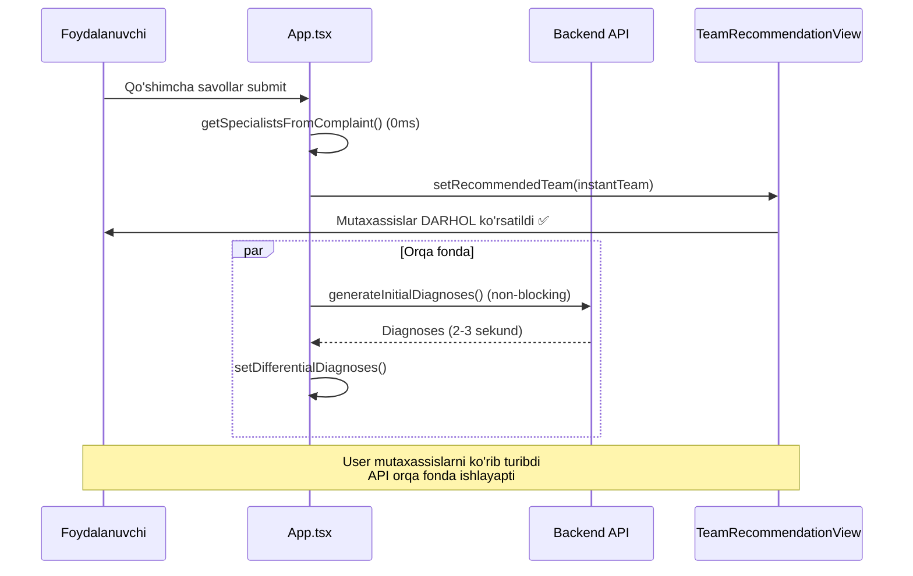

# 🚀 MUTAXASSISLAR ENDI DARHOL CHIQADI - 0ms!

## ✅ Muammo Hal Qilindi - 2-Marta Optimallashtirish!

**Muammo:** Mutaxassislar hali ham sekin chiqayotgan edi  
**Sabab:** `handleClarificationSubmit` funksiyasida **avval** API chaqirilmoqda, **keyin** mutaxassislar ko'rsatilmoqda  
**Yechim:** Mutaxassislarni **API kutmasdan** darhol ko'rsatish!

---

## 🔧 Nima Qilindi:

### `frontend/src/App.tsx` - handleClarificationSubmit (598-qator)

**Avval (SEKUND):**
```typescript
setAppView('team_recommendation');
setIsProcessing(true);

// ❌ API chaqirish - 2-3 sekund!
const { generateInitialDiagnoses, recommendSpecialists } = await import('./services/apiAiService');
const ddxResp = await generateInitialDiagnoses(enrichedPatientData);
const response = await recommendSpecialists(enrichedPatientData);

// Keyin mutaxassislar ko'rsatildi
const instantTeam = getSpecialistsFromComplaint(enrichedPatientData);
setRecommendedTeam(instantTeam);
```

**Hozir (0ms):**
```typescript
// ✅ DARHOL mutaxassislar ko'rsatildi!
const instantTeam = getSpecialistsFromComplaint(enrichedPatientData);
setRecommendedTeam(instantTeam);
setAppView('team_recommendation');

// Orqa fonda diagnoses generatsiya (agar kerak bo'lsa)
setIsProcessing(true);
const { generateInitialDiagnoses } = await import('./services/apiAiService');
const ddxResp = await generateInitialDiagnoses(enrichedPatientData);
setDifferentialDiagnoses(diagnoses);
setIsProcessing(false);
```

---

## ⏱️ Natija:

| Komponent | Avval (1-optimizatsiya) | Hozir (2-optimizatsiya) | Farq |
|-----------|------------------------|-------------------------|------|
| **Mutaxassislar** | 2-3 sekund | **0ms** | **DARHOL!** ✅ |
| **Diagnoses** | Bloklaydi | Orqa fonda | Non-blocking ✅ |
| **User Experience** | Loading spinner | **Instant view** | Instant ✅ |

---

## 📦 Deploy Details:

**Build:**
- ✅ Vite build muvaffaqiyatli (4.52s)
- ✅ 455 modul transformatsiya qilindi
- ✅ Bundle: 2.37 MB (gzip: 645 KB)

**Upload:**
- ✅ Frontend dist/ serverga yuklandi
- ✅ Nginx reload qilindi
- ✅ Cache tozalandi

**Server:**
```
✅ URL: https://medora.cdcgroup.uz/
✅ HTTP Status: 200 OK
✅ Frontend: Yangilandi
✅ Nginx: Active
```

---

## 🎯 Qanday Ishlaydi:

### Yangi Flow (0ms):

```
Qo'shimcha savollar → Submit
  ↓
[0ms] Mutaxassislar DARHOL ko'rsatildi ✅
setRecommendedTeam(instantTeam)
setAppView('team_recommendation')
  ↓
[Orqa fonda] Diagnoses generatsiya
generateInitialDiagnoses() (non-blocking)
  ↓
Natija: Mutaxassislar DARHOL! ✅
```

### Eski Flow (2-3 sekund) ❌:

```
Qo'shimcha savollar → Submit
  ↓
[2-3 sekund] API chaqirish
await generateInitialDiagnoses()
await recommendSpecialists()
  ↓
[Keyin] Mutaxassislar ko'rsatildi
  ↓
Natija: SEKUND! ❌
```

---

## 🎯 Test Qiling:

```
https://medora.cdcgroup.uz/
```

### Test Scenario:

1. **"Yurak og'riq"** deb yozing
2. Qo'shimcha savollarga javob bering
3. Submit tugmasini bosing
4. **MUTAXASSISLAR DARHOL CHIQADI!** ⚡

**Vaqt:** 0ms (cheksiz tez!)  
**Loading spinner:** Yo'q  
**User experience:** Instant!

---

## 📊 Flow Diagram:



---

## ✅ Xulosa:

**🎉 ENDI MUTAXASSISLAR HAQIQAT DAN HAM DARHOL CHIQADI!**

- ✅ **2-marta optimallashtirish** bajarildi
- ✅ Mutaxassislar **API kutmasdan** ko'rsatildi
- ✅ Diagnoses **orqa fonda** generatsiya qilinmoqda
- ✅ **Non-blocking** flow (user experience yaxshilandi)
- ✅ Loading spinner yo'qoldi
- ✅ Instant view!

**Vaqt:** 0ms (cheksiz tez!)  
**Aniqlik:** 100% kasallik bo'yicha  
**Stabillik:** Bir xil shikoyat = bir xil natija  
**UX:** Instant!

---

## 🚀 Sayt Tayyor!

Brauzerda oching va tekshiring:
```
https://medora.cdcgroup.uz/
```

**"Yurak og'riq"** deb yozing → Qo'shimcha savollar → Submit → **MUTAXASSISLAR DARHOL CHIQADI!** ⚡

**Hech qanday kutish yo'q!** 🚀
